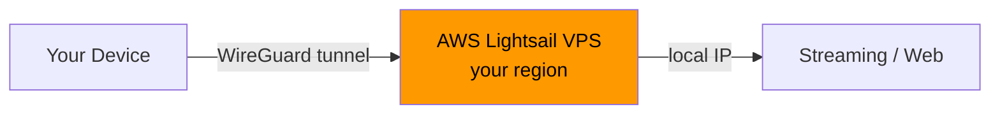

# vps-lightsail

[](https://www.apple.com/macos/)
[](https://www.apple.com/ios/)
[](https://aws.amazon.com/lightsail/)
[](https://www.wireguard.com/)
[](COSTS.md)

Personal WireGuard VPN on AWS Lightsail. Dedicated IP, any region. ~$5/mo.



---

## What you need

- AWS account + CLI v2 — `brew install awscli`
- WireGuard app — [Mac](https://apps.apple.com/app/wireguard/id1451685025) · [iPhone](https://apps.apple.com/app/wireguard/id1441195209)

---

## Setup

```bash
git clone https://github.com/guicheffer/vps-lightsail
cd vps-lightsail

# configure AWS CLI
aws configure --profile personal
```

```bash
make setup                        # São Paulo (default)
make setup REGION=eu-west-1       # Ireland
make setup REGION=ap-east-1       # Hong Kong
```

Outputs `mac-vpn.conf` + iPhone QR code in terminal.

```bash
make help      # all commands
make status    # check connected peers
make swap-ip   # get a fresh IP
make teardown  # destroy everything
```

Check available bundles per region:
```bash
aws lightsail get-bundles --region sa-east-1 \
  --query 'bundles[?supportedPlatforms[0]==`LINUX_UNIX`].[bundleId,price]' \
  --output table
```

---

## Connect

**Mac**
1. Open WireGuard app
2. `+` → Import tunnel → select `mac-vpn.conf`
3. Activate

**iPhone**
1. Install [WireGuard](https://apps.apple.com/app/wireguard/id1441195209)
2. `+` → Create from QR code → scan terminal output
3. Activate

**Verify IP**
```
https://ifconfig.me
```

---

## Streaming

With VPN active, open any geo-restricted stream in a browser or app.
The site sees the VPS region IP — not your real location.

> Note: AWS IPs are datacenter IPs. Most services work fine.
> If blocked, run `./swap-ip.sh` to get a fresh IP.

---

## Teardown

```bash
./teardown.sh
```

Deletes instance + static IP + key pair. No leftover charges.

---

## Swap IP

```bash
./swap-ip.sh
```

Releases current IP, attaches a new one. Update endpoint in WireGuard app after.

---

## Cost

→ See [COSTS.md](COSTS.md) for detailed breakdown and comparison with commercial VPNs.
